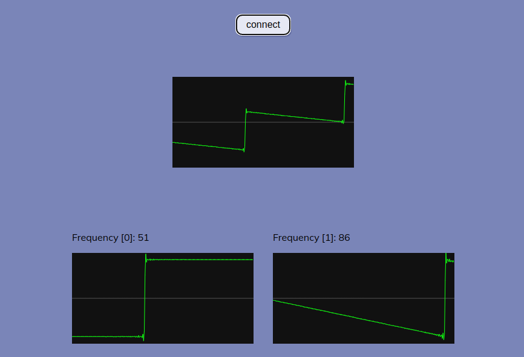
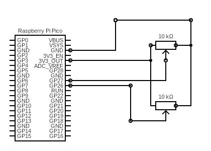

# Web Serial API Example Project

A simple project demonstrating a [Raspberry Pi Pico](https://www.raspberrypi.com/products/raspberry-pi-pico/) [MicroPython](https://micropython.org/) program communicating via [USB](https://en.wikipedia.org/wiki/USB) to the [Chrome web browser](https://www.google.com/chrome/) using the [Web Serial API](https://developer.mozilla.org/en-US/docs/Web/API/Web_Serial_API).

## [Live Demo](https://drohen.github.io/serial-web-test/) ((d[-_-]b))

**NOTE**: [check the web serial compatibility table](https://developer.mozilla.org/en-US/docs/Web/API/Serial#browser_compatibility) for what browser version you will need.

Refer to the [try it out](#try-it-out) information below to get started.

## Contents

- [What is does](#what-is-does)
- [Try it out](#try-it-out)
  * [Pico](#pico)
  * [Web Application](#web-application)
- [What is the purpose of this project?](#what-is-the-purpose-of-this-project)
- [Project inspirations](#project-inspirations)
- [Project design](#project-design)
- [Author](#author)

## What is does

The Pico's program listens on [2 of its built-in](https://datasheets.raspberrypi.com/pico/Pico-R3-A4-Pinout.pdf) [ADC](https://en.wikipedia.org/wiki/Analog-to-digital_converter) inputs for the values of connected [variable resistors, such as potentiometers](https://en.wikipedia.org/wiki/Potentiometer).

The values read are then transmitted via serial communication over USB on the Pico's onboard USB connector to an attached computer. When the web application has connected, and is listening, to the serial device, it can read these values.

The web application transforms these values into a frequency range that is assigned to separate oscillators created via the [Web Audio API](https://developer.mozilla.org/en-US/docs/Web/API/Web_Audio_API). The oscillators are visualised with virtual oscillopscopes, and output to the available audio output device.

## Try it out

### Pico

- Ensure you've followed the [Raspberry Pi Pico "Getting Started" tutorial, provided by the Raspberry Pi Foundation](https://projects.raspberrypi.org/en/projects/getting-started-with-the-pico/2).
- Load the script in `micropython/main.py` onto your Raspberry Pi Pico. Ensure it is saved to your Pico, using the information provided in the tutorial.
- Connect 2 10K B-type potentiometers to your Pico via a breadboard.
	- The left most terminal of each potentiometer should be connected to the positive rail of the breadboard. 
	- The right most terminal of each potentiometer should be connected to the negative rail of the breadboard.
	- The center terminal of one potentiometer connects to PIN 26 of the Pico, while the other connects to PIN 27. 
	- Connect one of the 3V3 pins, such as PIN 31, of the PICO to the positive rail of the breadboard.
	- Connect one of the ground pins, such as PIN 33, of the PICO to the negative rail of the breadboard.

- Optionally, the program can be run using the IDE at this point, and you might see some unintelligible output in the console of the IDE.
- Disconnect the IDE from your Pico and close the IDE.
- Unplug and re-connect the Pico via USB.

### Web Application

Don't want to clone? Try the [demo](https://drohen.github.io/serial-web-test/) instead.

- Install a browser [that supports Web Serial API](https://developer.mozilla.org/en-US/docs/Web/API/Serial#browser_compatibility) and [the Web Audio API](https://developer.mozilla.org/en-US/docs/Web/API/Web_Audio_API).
	- As of this project, only the latest versions of Chrome, Edge, and Opera are supported.
- Install [NodeJS](https://nodejs.org).
- Clone or download this project's repository.
- From within the project root directory, install the dependencies: `npm i`.
- Run the project: `npm start`.
	- The browser should automatically open and display the web application, otherwise you can do this step manually using the information in the terminal.
- (With the USB attached as described in the above steps):
	- Click the `Connect` button.
	- In the list that appears, select the device listed that corresponds to the Pico.
- 3 oscilloscopes should appear in under a second, and sound should be audible through your audio output device.
	- By manipulating the potentiometer, both the visuals of the oscilloscopes, the frequency value displayed, and the sound generated should change.

## What is the purpose of this project?

This project is intended to serve as a starting point for people interested in how to get ADC input readings from their Pico, use interactions with these inputs to be communicated to a web browser, and transform this information into another usable form. The minimal amount of code required to create a system such as this can enable rapid prototyping and creative iteration to explore new ways to interact with systems. Additionally, the project itself serves as a rudimentary musical instrument, a sound exploration tool.

## Project inspirations

[rePatcher](http://www.openmusiclabs.com/projects/repatcher/index.html) by [Open Music Labs](http://www.openmusiclabs.com) provided the original ideas for utilising and structuring the ADC values into serial data. rePatcher, and an earlier attempt of this project, both used Puredata for the audio generation. However, the availability of the Web Serial API in Chrome was an invitation to use the browser as the audio synthesis platform. Further, the oscilloscope code was adapted from the [webaudio-oscilloscope](https://github.com/theanam/webaudio-oscilloscope) project.

## Project design

The web application utilises an Observer paradigm to pass messages between different components. As the browser requires a secure or local context, user interaction, and granted permissions to utilise both the Web Audio and Web Serial API, the connect button is the initial entry point for the user, and the project either needs to run on the user's machine or within the HTTPS protocol.

Further, the serial encoding of the data has a set length of 5 bytes per message. The initial byte indicates that the message is the expected message, and that only the following 4 bytes are necessary. Bytes 1 and 2 are combined to create a single 10bit value, representing the ADC reading on PIN 26. The same applies to 3 and 4 for PIN 27.

The two readings go to two different oscillators, a square and a sawtooth. These are both combined and their output is what can be heard and visualised in the top oscilloscope. A gain node is used between the oscillators and output to reduce clipping.

Readings from the ADC are performed within a loop, and occur every 5ms. This appears to keep the cognitive perception of user interaction and perceived change in audio fairly close such that any latency is unnoticeable.

Please explore the code in the `src` and `micropython` directories for further information.

## Author

This project was created by [DROHEN](https://github.com/drohen) for the purpose of research and education. It uses the MIT license. Contributions and feedback are welcome.